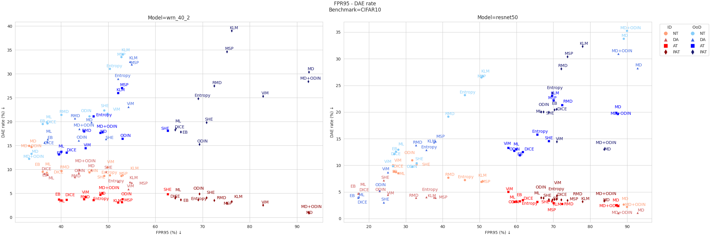
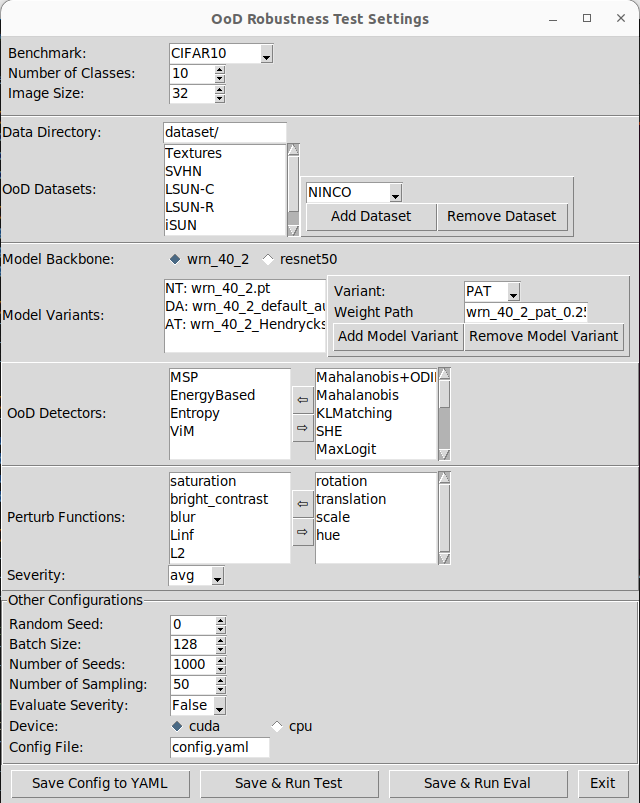

# OoD Robustness Benchmark
This is the official code implementation of the paper "Out-of-Distribution Detectors: Not Yet Primed for Practical Deployment", which carried out large-scale evaluation on Out-of-distribution (OoD) detectors' performance and robustness metrics under natural perturbations.

<!-- ## 📝 Table of Contents

- [About](#about)
- [Getting Started](#getting_started)
- [Deployment](#deployment)
- [Usage](#usage)
- [Built Using](#built_using)
- [TODO](../TODO.md)
- [Contributing](../CONTRIBUTING.md)
- [Authors](#authors)
- [Acknowledgments](#acknowledgement) -->

## 🧐 About <a name = "about"></a>

<!-- OoD detectors work together with deep neural networks (DNNs) to reduce the risks of OoD samples on DNN predictions. However, existing OoD detectors, built on data-centric designs, are subject to robustness issues.  -->

This repository targets at benchmarking the practical robustness of the mainstream OoD detectors in computer vision tasks, considering natural input perturbations that may come from camera positions and lighting conditions of 1-5 severity levels.

In addition, we examine the commonly-applied alarming mechanisms designed to reduce DNN prediction errors and to detect distributional shifts in real-world settings. We also incorporate correlation studies, highlighting significant inherent challenges in OoD detection robustness.


## 🏁 Getting Started <a name = "getting_started"></a>
Our robustness benchmark is based on pip and virtural environment, which requires minimum dependencies to deloy on your local machine.

### Prerequisites
To setup the virtual environment, just clone our latest version:
```
git clone https://github.com/dingw00/ood_rob_eval.git
```
To prepare the virtual environment, just go to the root directory and run:
```
make build
```
To prepare the datasets, please [download](https://figshare.com/s/28c0d4ffa971b1445ede) and save them in the `dataset` directory.

### Setup
To set up the configuration, please run:
```
make config
```
This will start the tkinter GUI where you can select several customized options and save them in the yaml file for OoD robustness test and evaluation.
<p align="center" width="100%">

</p>
It is also possibe to customize the experiment settings directly by modifyig the default configuration file `config.yaml` before running the experiments.

We provide several options to select from: [3 benchmarks](#datasets), [a variety of DNN models](#models), [16 OoD detectors](#ood-detectors) and [9 types of functional perturbations of 5 severities](#perturbations).

## 🚀 Deployment

### OoD Test

To reproduce our experiment results, please run the automated OoD robustness test:
```
make run
```

### OoD Robustness Evaluation

To evaluate the OoD robustness test results, please run
```
make eval
```
To visualize the OoD detectors' performance and robustness metrics, please refer to the `notebooks/` directory and execute the jupyter notebooks in an interactive window. The evaluations and visualizations will be saved in the `results/` directory. We have uploaded all our experiment results [here](https://figshare.com/s/64930a52878e3f21c4ae). 

## 📋 Descriptions <a name = "desc"></a>
### Models
A variety of DNN models are supported in our project.

<table>
  <tr>
    <th align="center">Benchmark</th>
    <th align="center">Model Architecture</th>
    <th align="center">Variant</th>
    <th align="center">Accuracy (%)</th>
    <th align="center">Weight</th>
  </tr>
  <tr>
    <td rowspan="8" align="center">CIFAR10</td>
    <td rowspan="4" align="center">WRN-40-2</td>
    <td align="center">NT</td>
    <td align="center">94.73</td>
    <td align="left"><a href="https://github.com/dingw00/ood_rob_eval/blob/main/models/cifar10/state_dicts/wrn_40_2.pt">wrn_40_2.pt</a></td>
  </tr>
  <tr>
    <td align="center">DA</td>
    <td align="center">95.26</td>
    <td align="left"><a href="https://github.com/dingw00/ood_rob_eval/blob/main/models/cifar10/state_dicts/wrn_40_2_default_aug.pt">wrn_40_2_default_aug.pt</a></td>
  </tr>
  <tr>
    <td align="center">AT</td>
    <td align="center">95.08</td>
    <td align="left"><a href="https://github.com/dingw00/ood_rob_eval/blob/main/models/cifar10/state_dicts/wrn_40_2_Hendrycks2020AugMix.pt">wrn_40_2_Hendrycks2020AugMix.pt</a></td>
  </tr>
  <tr>
    <td align="center">PAT</td>
    <td align="center">84.95</td>
    <td align="left"><a href="https://github.com/dingw00/ood_rob_eval/blob/main/models/cifar10/state_dicts/wrn_40_2_pat_0.25_epoch_199.pt">wrn_40_2_pat_0.25_epoch_199.pt</a></td>
  </tr>
  <tr>
    <td rowspan="4" align="center">ResNet50</td>
    <td align="center">NT</td>
    <td align="center">94.84</td>
    <td align="left"><a href="https://github.com/dingw00/ood_rob_eval/blob/main/models/cifar10/state_dicts/resnet50.pt">resnet50.pt</a></td>
  </tr>
  <tr>
    <td align="center">DA</td>
    <td align="center">96.38</td>
    <td align="left"><a href="https://github.com/dingw00/ood_rob_eval/blob/main/models/cifar10/state_dicts/resnet50_da_all_199.pt">resnet50_da_all_199.pt</a></td>
  </tr>
  <tr>
    <td align="center">AT</td>
    <td align="center">86.84</td>
    <td align="left"><a href="https://github.com/dingw00/ood_rob_eval/blob/main/models/cifar10/state_dicts/resnet50_pgd_linf_8_pgd_l2_1_stadv_0.05_recoloradv_0.06_average.pt">resnet50_pgd_..._average.pt</a></td>
  </tr>
  <tr>
    <td align="center">PAT</td>
    <td align="center">82.41</td>
    <td align="left"><a href="https://github.com/dingw00/ood_rob_eval/blob/main/models/cifar10/state_dicts/resnet50_pat_self_0.5.pt">resnet50_pat_self_0.5.pt</a></td>
  </tr>
  <tr>
    <td rowspan="4" align="center">ImageNet-100</td>
    <td rowspan="4" align="center">ResNet50</td>
    <td align="center">NT</td>
    <td align="center">88.78</td>
    <td align="left"><a href="https://github.com/dingw00/ood_rob_eval/blob/main/models/imagenet100/state_dicts/resnet50.pt">resnet50.pt</a></td>
  </tr>
  <tr>
    <td align="center">DA</td>
    <td align="center">89.92</td>
    <td align="left"><a href="https://github.com/dingw00/ood_rob_eval/blob/main/models/imagenet100/state_dicts/resnet50_da_all_115.pt">resnet50_da_all_115.pt</a></td>
  </tr>
  <tr>
    <td align="center">AT</td>
    <td align="center">78.75</td>
    <td align="left"><a href="https://github.com/dingw00/ood_rob_eval/blob/main/models/imagenet100/state_dicts/resnet50_pgd_linf_4_pgd_l2_1200_jpeg_linf_0.125_stadv_0.05_recoloradv_0.06_random.pt">resnet50_pgd_..._random.pt</a></td>
  </tr>
  <tr>
    <td align="center">PAT</td>
    <td align="center">75.75</td>
    <td align="left"><a href="https://github.com/dingw00/ood_rob_eval/blob/main/models/imagenet100/state_dicts/resnet50_pat_alexnet_0.5.pt">resnet50_pat_alexnet_0.5.pt</a></td>
  </tr>
  <tr>
    <td rowspan="3" align="center">ImageNet-1k</td>
    <td align="center">SWIN</td>
    <td align="center">NT</td>
    <td align="center"> </td>
    <td align="left">swin_base_patch4_window7_224</td>
  </tr>
  <tr>
    <td align="center">DEIT</td>
    <td align="center">NT</td>
    <td align="center"> </td>
    <td align="left">deit_base_patch16_224</td>
  </tr>
  <tr>
    <td align="center">ViT</td>
    <td align="center">NT</td>
    <td align="center"> </td>
    <td align="left">vit_b_16</td>
  </tr>
</table>

### OoD Detectors
Our benchmark is implemented with a variety of SoTA OoD detectors based on [Pytorch-OoD](https://pytorch-ood.readthedocs.io/en/latest/index.html), as shown in the table below.
<table>
  <tr>
    <th align="center">Type</th>
    <th align="center">Detector</th>
    <th align="center">Abbreviation</th>
  </tr>
  <tr>
    <td rowspan="10" align="center">Uncertainty Quantification-<BR>Based</td>
    <td align="left">Maximum Softmax
</td>
    <td align="center">MSP</td>
  </tr>
  <tr>
    <td align="left">Maximum Logit</td>
    <td align="center">ML</td>
  </tr>
  <tr>
    <td align="left">Energy-Based</td>
    <td align="center">EB</td>
  </tr>
  <tr>
    <td align="left">Directed Sparisification</td>
    <td align="center">DICE</td>
  </tr>
  <tr>
    <td align="left">Virtual-Logit Matching</td>
    <td align="center">ViM</td>
  </tr>
  <tr>
    <td align="left">Entropy</td>
    <td align="center">Entropy</td>
  </tr>
  <tr>
    <td align="left">KL-Matching</td>
    <td align="center">KLM</td>
  </tr>
  <tr>
    <td align="left">Monte Carlo Dropout</td>
    <td align="center">MCD</td>
  </tr>
  <tr>
    <td align="left">Activation Shaping</td>
    <td align="center">ASH</td>
  </tr>
  <tr>
    <td align="left">Rectified Activations</td>
    <td align="center">ReAct</td>
  </tr>
  <tr>
    <td rowspan="4" align="center">Distance-Based</td>
    <td align="left">Mahalanobis Distance</td>
    <td align="center">MD</td>
  </tr>
  <tr>
    <td align="left">Relative Mahalanobis Distance</td>
    <td align="center">RMD</td>
  </tr>
  <tr>
    <td align="left">Simplified Hopfield Energy</td>
    <td align="center">SHE</td>
  </tr>
  <tr>
    <td align="left">Nearest Neighbor</td>
    <td align="center">KNN</td>
  </tr>
  <tr>
    <td align="center">Gradient-based</td>
    <td align="left">ODIN</td>
    <td align="center">ODIN</td>
  </tr>
</table>

### Datasets <a name = "datasets"></a>
 On each benchmark, the ID and OoD datasets for OoD robustness test are listed as follows.
<details open>
  <summary><b>Benchmark: CIFAR10</b></summary>
  <ul>
    <li>ID data: CIFAR10</li>
  </ul>
  <ul>
    <li>OoD data: </li>
    <ul>
      <li>Textures</li>
      <li>SVHN</li>
      <li>LSUN-C</li>
      <li>LSUN-R</li>
      <li>iSUN</li>
      <li>Places365</li>
    </ul>
  </ul>
</details>

<details open>
  <summary><b>Benchmark: ImageNet-100</b></summary>
  <ul>
    <li>ID data: ImageNet-100</li>
  </ul>
  <ul>
    <li>OoD data: </li>
    <ul>
      <li>NINCO</li>
      <li>Textures</li>
      <li>iNaturalist</li>
      <li>SUN</li>
      <li>Places</li>
    </ul>
  </ul>
</details>

<details open>
  <summary><b>Benchmark: ImageNet-1k</b></summary>
  <ul>
    <li>ID data: ImageNet-1k</li>
  </ul>
  <ul>
    <li>OoD data: </li>
    <ul>
      <li>NINCO</li>
      <li>Textures</li>
      <li>iNaturalist</li>
    </ul>
  </ul>
</details>

### Perturbations
The supported functional perturbations along with their hyperparameters are listed below. Please click on [this link](results/eval/severity_levels/perturbed_samples_demo) to see the perturbed images under different perturbations of 5 severity levels. We have uploaded the [corrupted datasets for CIFAR10](https://huggingface.co/datasets/dingw/corrupt_ood_cifar10) and [ImageNet-1k](https://huggingface.co/datasets/dingw/corrupt_ood_imagenet1k) benchmarks respectively in huggingface.
<table>
  <tr>
    <th align="center">Group</th>
    <th align="center">Functional Perturbation</th>
    <th align="center">Hyperparameters (Severity 1-5)</th>
  </tr>
  <tr>
    <td rowspan="3" align="center">Geometric Transformation</td>
    <td align="center">Rotation</td>
    <td align="left">rot=&#177;[6°,12°,18°,24°,30°]</td>
  </tr>
  <tr>
    <td align="center">Translation</td>
    <td align="left">trans=&#177;[4%,8%,12%,16%,20%]</td>
  </tr>
  <tr>
    <td align="center">Scaling</td>
    <td align="left">sca=&#177;[6%,12%,18%,24%,30%]</td>
  </tr>
  <tr>
    <td rowspan="3" align="center">Colour-Shifted Function based on HSB</td>
    <td align="center">Hue</td>
    <td align="left">hue=&#177;[0,0.06,0.09,0.12,0.15,0.18]&#960;</td>
  </tr>
  <tr>
    <td align="center">Saturation</td>
    <td align="left">sat=1&#177;1[0.16,0.32,0.48,0.64,0.80]</td>
  </tr>
  <tr>
    <td align="center">Brightness+<br>Contrast</td>
    <td align="left">bright=&#177;[0.06,0.12,0.18,0.24,0.30]<br>cont=&#177;[0.06,0.12,0.18,0.24,0.30]</td>
  </tr>
<tr>
    <td align="center">Gaussian Blur</td>
    <td align="center">Blur</td>
    <td align="left">CIFAR10: &#963;=[0.4,0.6,0.7,0.8,1.0], k=[5,5,7,7,9]<br>ImageNet-100: &#963;=[1,2,3,4,6], k=[9,17,25,33,49]
</td>
  </tr>
  <tr>
    <td rowspan="2" align="center">Additive perturbation bounded by L<sub>p</sub> norm</td>
    <td align="center">L<sub>&#8734;</sub> norm</td>
    <td align="left">CIFAR10: &#949;=[0.016,0.032,0.048,0.064,0.08]<br>ImageNet-100: &#949;=[0.04,0.08,0.12,0.16,0.20]
</td>
  </tr>
  <tr>
    <td align="center">L<sub>2</sub> norm</td>
    <td align="left">CIFAR10: &#949;=[0.8,1.6,2.4,3.2,4.0]<br>ImageNet-100: &#949;=[16,32,48,64,80]</td>
  </tr>
</table>
